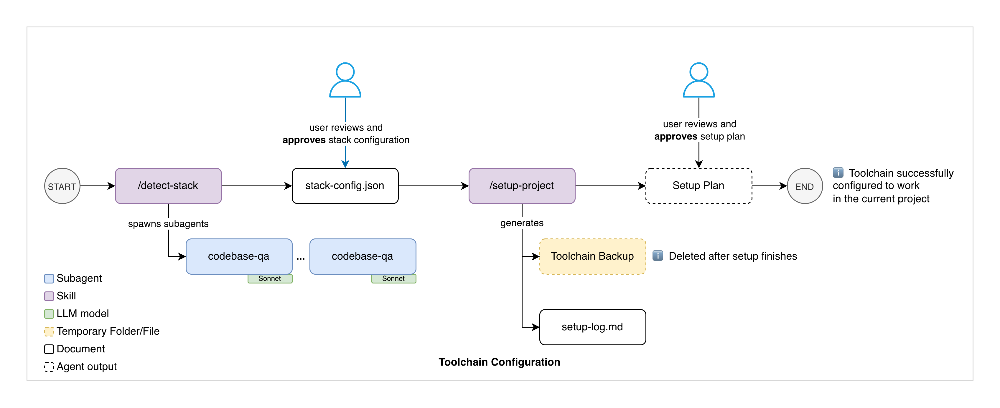

# Documentation

> Start here. This README explains what lives in `docs/`, how it connects to the `.claude/` toolchain and `CLAUDE.md`, and where to go depending on what you need.

**Already working on a project with this toolchain?** Skip to [I need to...](#i-need-to) for a quick lookup table, or read [Workflow for implementing a feature](#workflow-for-implementing-a-feature) for the end-to-end process.

**Setting up the toolchain in a new project?** Read [Prerequisites](#prerequisites) then [Set up this toolchain in a new project](#set-up-this-toolchain-in-a-new-project).

---

## Prerequisites

- **Claude Code CLI** — install via `npm install -g @anthropic-ai/claude-code` (requires Node.js 18+). See [claude.ai/code](https://claude.ai/code) for setup instructions.
- **An active Anthropic API key or Claude Pro/Max subscription** — Claude Code needs API access to function.
- **Project dependencies** — your project's own toolchain (Node.js, Composer, etc.) should be installed and working before running `/detect-stack`.

---

## Invocation syntax

All workflow steps use **skill** syntax — type `/name` in the Claude Code prompt:

| Syntax  | What it invokes                                                     | Example                          |
| ------- | ------------------------------------------------------------------- | -------------------------------- |
| `/name` | **Skill** — the standard way to invoke toolchain commands           | `/plan-feature`, `/commit`, `/preflight` |
| `@name` | **Agent** — direct access to a subagent for ad-hoc research         | `@codebase-qa`, `@impact-analyser` |

Skills handle orchestration, scaffolding, and workflow steps. Some skills delegate to agents under the hood (e.g. `/preflight` spawns the `preflight` agent). For ad-hoc investigation, you can still invoke research agents directly with `@name`.

---

## How it all fits together

```
CLAUDE.md                  <- Project-specific config: architecture, commands, key dependencies
.claude/                   <- Portable AI toolchain: agents, skills, hooks, rules
  rules/                   <- Convention files (code standards, commit format, language conventions)
  hooks/config.sh          <- Shell variables (paths, commands) -- rewritten by /setup-project
  stack-capabilities.json  <- Maps skills/hooks/rules to required stack capabilities
docs/                      <- This folder -- living documentation that agents read and write during feature work
  manuals/                 <- Workflow guides, playbooks, reference, and architecture concepts
  plans/                   <- Implementation plans (input for /implement-feature)
  features/                <- Architecture documents for completed features
  requirements/            <- Tickets and spec documents (input for /plan-feature)
  scripts/                 <- Utility scripts (e.g., Jira ticket fetcher)
```

**CLAUDE.md** and **`.claude/rules/`** are the sources of truth for project-specific data and conventions. The `.claude/` tools (agents, skills) and `docs/manuals/` all reference them dynamically rather than hardcoding values — this is what makes the entire system portable across projects. Rules files load automatically based on the files being edited, scoping conventions to where they're relevant.

---

## Tutorial about how to use this toolchain

The "Claude Code Feature Development Toolchain: A Step-by-Step Tutorial" Confluence tutorial can be [found here](https://aligent.atlassian.net/wiki/spaces/AL/pages/4713447425/Claude+Code+Feature+Development+Toolchain+A+Step-by-Step+Tutorial).

---

## Set up this toolchain in a new project

This toolchain is a **template repo**. To adopt it:

1. Copy the files and directories from this repo into your project
2. Run `/detect-stack` — auto-detects your technology stack and writes `.claude/stack-config.json`
3. Run `/setup-project` — generates `CLAUDE.md` and `.claude/rules/`, prunes inapplicable skills/hooks/rules, and configures the toolchain for your stack



#### Step 1: Copy the toolchain

Copy all the files and directories from this repo into your project root. These contain the full set of agents, skills, hooks, MCPs, rules examples, and documentation templates. Everything inapplicable to your stack will be pruned in Step 3.

#### Step 2: `/detect-stack`

Spawns `codebase-qa` subagents (using Sonnet) to scan your project's package manifests, config files, framework markers, and directory structure. Produces `.claude/stack-config.json` — a structured description of your stack's capabilities (e.g. `magento`, `react`, `nextjs`, `graphql`).

**User checkpoint:** Review and approve the detected stack configuration before proceeding.

#### Step 3: `/setup-project`

Reads `stack-config.json` and performs a multi-phase setup:

1. Creates a **toolchain backup** (deleted automatically after setup completes)
2. Generates a slim **CLAUDE.md** (architecture, commands, key dependencies) and **`.claude/rules/`** files (code standards, commit conventions, testing, language-specific conventions with path-scoped frontmatter)
3. Presents a **setup plan** for review — lists what will be generated, pruned, and configured
4. After approval: prunes inapplicable skills, hooks, and rules; updates agent configurations; rewrites `config.sh` with project-specific paths; cleans up example files
5. Writes **`setup-log.md`** documenting what was configured

**User checkpoint:** Review and approve the setup plan before destructive changes are applied.

#### Supported stacks

Magento + React/Vite, Magento + Luma (pure PHP), Next.js + Magento, Next.js + BigCommerce, React SPA + REST/GraphQL, and more. When the Playwright MCP is configured (`.mcp.json`), agents gain browser automation capabilities: automated bug reproduction, visual regression screenshots, runtime accessibility testing, Lighthouse audits, and feature documentation screenshots.

#### Troubleshooting setup

| Problem                                       | Solution                                                                                                                                                                                          |
| --------------------------------------------- | ------------------------------------------------------------------------------------------------------------------------------------------------------------------------------------------------- |
| `/detect-stack` got the stack wrong           | Edit `.claude/stack-config.json` manually to fix capabilities, then re-run `/setup-project`                                                                                                       |
| `/setup-project` pruned a skill/hook you need | Check `.claude/setup-log.md` to see what was removed. Restore from git (`git checkout -- .claude/skills/<name>/`) and remove the skill's entry from `stack-capabilities.json` so it's always kept |
| CLAUDE.md has incorrect project details       | Edit it directly — it's a regular markdown file. The toolchain reads it at runtime                                                                                                                |
| A rules file has wrong conventions            | Edit the relevant `.claude/rules/*.md` file directly                                                                                                                                              |
| Want to re-run setup from scratch             | Copy the toolchain files again from the template repo and repeat Steps 2-3                                                                                                                        |

---

## Workflow for implementing a feature

This is the end-to-end process for delivering a feature using the `.claude/` toolchain. Each step uses a specific skill or manual action, and `docs/` folders act as the handoff points between phases.

For the full detailed guide with flowcharts and slash command inventory, see [manuals/01-workflows/feature-development.md](manuals/01-workflows/feature-development.md).


### Step 1 — Gather requirements

Save the ticket export, spec document, or acceptance criteria into `docs/requirements/`. The planner agent reads from this folder.

For Jira tickets, use the fetch script to pull content automatically:

```
./docs/scripts/fetch-jira-ticket.sh <TICKET-ID>
```

This fetches the ticket description, comments, and attached images into `docs/requirements/`. Requires `JIRA_EMAIL` and `JIRA_API_TOKEN` in `.env.development` (see `.env.development.example`). Generate a token at [https://id.atlassian.com/manage-profile/security/api-tokens](https://id.atlassian.com/manage-profile/security/api-tokens).

### Step 2 — Plan

```
/plan-feature [requirements file path, ticket number, or feature description]
```

The `/plan-feature` command orchestrates three phases:

1. Spawns **2-3 `codebase-qa` sub-agents** in parallel to research how reference features implement the patterns needed
2. Optionally spawns **1-2 `impact-analyser` sub-agents** to assess what existing code will be affected
3. Passes all findings to the `@feature-planner` agent, which synthesizes them into a file-by-file implementation plan at `docs/plans/TICKET-XXX-feature-name.md`

**Comprehension checkpoint:** Verify that you can explain the feature's data flow end-to-end before moving on. If you can't trace this from the plan alone, use `@codebase-qa` to fill gaps.

### Step 3 — Implement and review

```
/implement-feature docs/plans/TICKET-XXX-feature-name.md
```

The `/implement-feature` skill orchestrates:

1. **Validates the plan** — checks for unresolved open questions
2. **Spawns `@feature-implementer`** in the working directory — writes all code, runs verification, produces a change summary
3. **Spawns `@reviewer`** — reviews the uncommitted changes for correctness and patterns compliance
4. **Reports combined results** — change summary, verification, review findings, key files to understand

### Step 4 — Iterate manually (if needed)

Fix issues found by the reviewer or your own inspection. Useful slash commands for targeted work:

| Command             | What it does                                              |
| ------------------- | --------------------------------------------------------- |
| `/gql`              | Scaffold a GraphQL mutation + resolver + types            |
| `/plugin`           | Create a Magento plugin with di.xml wiring                |
| `/email-template`   | Scaffold transactional email (model + templates + config) |
| `/react-new-widget` | Create a new React widget entry point                     |
| `/layout-diff`      | Compare a theme layout override with its vendor original  |

For frontend/UI bugs that aren't obvious from static checks or review feedback, use `/debug-frontend` to diagnose with runtime evidence. For a single, straightforward bug, run it directly in your current session — the skill handles hypothesis generation, instrumentation, reproduction (automated via Playwright when available), and log-based analysis inline. For multiple bugs or complex issues requiring extended investigation, branch off the main session using `/branch`, run `/debug-frontend` in the branched session, then `/resume` back to the main session once the fix is in place. The branched session inherits your implementation context while keeping the verbose debugging output separate. See [the detailed workflow guide](manuals/01-workflows/feature-development.md#when-a-bug-needs-runtime-debugging) for more on both approaches.

If the plan itself is wrong (an assumption didn't hold, requirements changed, or the reviewer flagged a fundamental issue), run `/correct-course` to amend it:

```
/correct-course docs/plans/PROJ-123-feature.md "the API doesn't support batch mutations"
```

This compares the plan to the current implementation state, proposes targeted amendments, and updates the plan file with a documented correction log. Resume implementation from the updated plan.

See [manuals/03-reference/ai-tools-reference.md](manuals/03-reference/ai-tools-reference.md) for the full list of available commands, agents, and skills.

### Step 5 — Quality checks

```
/preflight
```

Runs the full quality suite. The specific checks depend on your stack (see CLAUDE.md Commands). Fix any reported issues before proceeding.

### Step 6 — Run tests (if applicable)

```
/test changed
```

Runs tests for changed files only.

### Step 7 — Commit

```
/commit
```

Analyses all uncommitted changes and proposes a logical breakdown into ordered commits following your project's commit conventions (from CLAUDE.md). Review the plan, then reply `"go"` to execute.

### Step 8 — Document

```
/document TICKET-XXX
```

Generates an architecture document at `docs/features/TICKET-XXX-feature-name.md`. **Mandatory for multi-layer features.** After writing the document, `/document` analyses the implementation for lessons learned — non-obvious patterns, gotchas, or new reuse references — and proposes them as concrete additions to `CLAUDE.md` or `.claude/rules/` for your approval.

### Step 9 — Commit documentation and create PR

Run `/commit` again to commit the architecture document, then create the PR.

---

### How `docs/` connects the steps

| Folder          | Written by                | Read by                      | Purpose in the workflow         |
| --------------- | ------------------------- | ---------------------------- | ------------------------------- |
| `requirements/` | Developer (manual)        | `/plan-feature`              | Input: what to build            |
| `plans/`        | `/plan-feature`           | `/implement-feature`         | Handoff: how to build it        |
| `features/`     | `/document`               | Future developers, AI agents | Output: how it was built        |
| `manuals/`      | Maintained with toolchain | Developers, AI agents        | Reference: how to use the tools |

**CLAUDE.md and `.claude/rules/` configure everything.** Every agent and skill reads CLAUDE.md for architecture, commands, and paths, and `.claude/rules/` for conventions, commit format, and reuse references.

---

## I need to...

### Work on this project

| Goal                                         | Where to go                                                                                                    |
| -------------------------------------------- | -------------------------------------------------------------------------------------------------------------- |
| Get oriented in this repo                    | [manuals/00-getting-started/onboarding.md](manuals/00-getting-started/onboarding.md)                           |
| Plan and deliver a feature                   | [manuals/01-workflows/feature-development.md](manuals/01-workflows/feature-development.md)                     |
| Debug something broken                       | [manuals/02-playbooks/debugging.md](manuals/02-playbooks/debugging.md)                                         |
| Explore unfamiliar code                      | [manuals/02-playbooks/exploration-and-investigation.md](manuals/02-playbooks/exploration-and-investigation.md) |
| Look up an agent or skill                    | [manuals/03-reference/ai-tools-reference.md](manuals/03-reference/ai-tools-reference.md)                       |
| Understand an architecture decision          | [manuals/05-concepts/](manuals/05-concepts/) — one topic per file                                              |
| Read the plan for a feature in progress      | `plans/` — one file per planned feature                                                                        |
| Understand a completed feature's design      | `features/` — architecture documents with Mermaid diagrams                                                     |
| Read the original requirements for a feature | `requirements/` — ticket exports and spec documents                                                            |

---

## Folder reference

### `manuals/`

Workflow guides, playbooks, reference docs, and architecture concepts for using the `.claude/` toolchain effectively. These are **project-portable** — all project-specific values are resolved from CLAUDE.md at runtime.

See [manuals/README.md](manuals/README.md) for the full folder map and quick lookup table.

**Maintained by:** the `sync-manuals-check.sh` hook automatically prompts documentation updates whenever `.claude/` tooling files or `CLAUDE.md` are modified.

### `plans/`

Implementation plans produced by `/plan-feature`. Each file represents a planned feature with a file-by-file breakdown, risk assessment, and implementation checklist.

**Naming convention:** `TICKET-XXX-feature-name.md`

**Workflow:**

1. Drop requirements into `requirements/`
2. Run `/plan-feature` — it orchestrates research and writes a plan here
3. Review and refine the plan (resolve open questions)
4. Run `/implement-feature` with the plan file as input

Plans are living documents — update them if scope changes during implementation.

### `features/`

Architecture documents for completed features. Each document includes Mermaid diagrams, data flow sequences, configuration paths, and deployment steps.

**Naming convention:** `TICKET-XXX-feature-name.md`

**When to create:** After implementing a multi-layer feature, before creating the PR. Run `/document TICKET-XXX` to generate the document. The `/commit` skill reminds you if one is missing.

**Why it matters:** Without these documents, future developers and AI agents must re-read every file to understand a feature's design. The architecture document provides the map.

### `requirements/`

Ticket exports, spec documents, and acceptance criteria. Drop files here before running `/plan-feature` — the planner reads this folder to understand scope.

**Supported formats:** XML exports, text files, markdown, images.

### `scripts/`

Utility scripts for the development workflow (e.g., ticket fetchers). These are optional and project-specific.

### `examples/`

Reference examples showing what `/setup-project` generates for different technology stacks:

- **`magento-react/`** — Magento 2 + React/Vite (same content as root-level `.example` files)
- **`nextjs/`** — Next.js 15 + React 19 + Apollo Client monorepo
- **`react-spa/`** — React SPA + Vite + REST API (TanStack Query, Zustand, React Router)

These files are reference only — they are not consumed by the toolchain and do not need to be deleted during setup.

---
