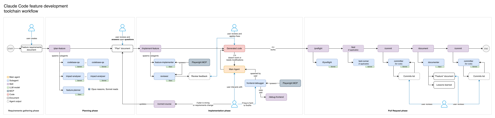

# Documentation

> Start here. This README explains what lives in `docs/`, how it connects to the `.claude/` toolchain and `CLAUDE.md`, and where to go depending on what you need.

---

## How it all fits together

```
CLAUDE.md                  <- Project-specific config: architecture, commands, conventions, reuse rules
.claude/                   <- Portable AI toolchain: agents, skills, hooks
  hooks/config.sh          <- Shell variables (paths, commands) -- rewritten by /setup-project
  stack-capabilities.json  <- Maps skills/hooks to required stack capabilities
docs/                      <- This folder -- living documentation that agents read and write during feature work
  manuals/                 <- Workflow guides, playbooks, reference, and architecture concepts
  plans/                   <- Implementation plans (input for @feature-implementer)
  features/                <- Architecture documents for completed features
  requirements/            <- Tickets and spec documents (input for @feature-planner)
```

**CLAUDE.md** is the single source of truth for project-specific data. The `.claude/` tools (agents, skills) and `docs/manuals/` all reference it dynamically rather than hardcoding values — this is what makes the entire system portable across projects.

---

## I need to...

### Work on this project


| Goal                                         | Where to go                                                                                                      |
| -------------------------------------------- | ---------------------------------------------------------------------------------------------------------------- |
| Get oriented in this repo                    | `[manuals/00-getting-started/onboarding.md](manuals/00-getting-started/onboarding.md)`                           |
| Plan and deliver a feature                   | `[manuals/01-workflows/feature-development.md](manuals/01-workflows/feature-development.md)`                     |
| Debug something broken                       | `[manuals/02-playbooks/debugging.md](manuals/02-playbooks/debugging.md)`                                         |
| Explore unfamiliar code                      | `[manuals/02-playbooks/exploration-and-investigation.md](manuals/02-playbooks/exploration-and-investigation.md)` |
| Look up an agent or skill                    | `[manuals/03-reference/ai-tools-reference.md](manuals/03-reference/ai-tools-reference.md)`                       |
| Understand an architecture decision          | `[manuals/05-concepts/](manuals/05-concepts/)` — one topic per file                                              |
| Read the plan for a feature in progress      | `plans/` — one file per planned feature                                                                          |
| Understand a completed feature's design      | `features/` — architecture documents with Mermaid diagrams                                                       |
| Read the original requirements for a feature | `requirements/` — ticket exports and spec documents                                                              |


### Set up this toolchain in a new project

This toolchain is a **template repo**. To adopt it:

1. Copy the `.claude/` directory and `docs/` directory into your project
2. Run `/detect-stack` — auto-detects your technology stack and writes `.claude/stack-config.json`
3. Run `/setup-project` — generates `CLAUDE.md`, prunes inapplicable skills/hooks, and configures the toolchain for your stack

The toolchain supports: Magento + React/Vite, Magento + Luma (pure PHP), Next.js + Magento, Next.js + BigCommerce, React SPA + REST/GraphQL, and more.

---

## Folder reference

### `manuals/`

Workflow guides, playbooks, reference docs, and architecture concepts for using the `.claude/` toolchain effectively. These are **project-portable** — all project-specific values are resolved from CLAUDE.md at runtime.

See `[manuals/README.md](manuals/README.md)` for the full folder map and quick lookup table.

**Maintained by:** the `sync-manuals-check.sh` hook automatically prompts documentation updates whenever `.claude/` tooling files or `CLAUDE.md` are modified.

### `plans/`

Implementation plans produced by the `@feature-planner` agent. Each file represents a planned feature with a file-by-file breakdown, risk assessment, and implementation checklist.

**Naming convention:** `TICKET-XXX-feature-name.md`

**Workflow:**

1. Drop requirements into `requirements/`
2. Run `/plan-feature` — it orchestrates research and writes a plan here
3. Review and refine the plan (resolve open questions)
4. Run `/implement-feature` with the plan file as input

Plans are living documents — update them if scope changes during implementation.

### `features/`

Architecture documents for completed features. Each document includes Mermaid diagrams, data flow sequences, configuration paths, and deployment steps.

**Naming convention:** `TICKET-XXX-feature-name.md`

**When to create:** After implementing a multi-layer feature, before creating the PR. Run `@documenter TICKET-XXX` to generate the document. The `@committer` agent reminds you if one is missing.

**Why it matters:** Without these documents, future developers and AI agents must re-read every file to understand a feature's design. The architecture document provides the map.

### `requirements/`

Ticket exports, spec documents, and acceptance criteria. Drop files here before running `@feature-planner` — the planner reads this folder to understand scope.

**Supported formats:** XML exports, text files, markdown, images.

### `scripts/`

Utility scripts for the development workflow (e.g., ticket fetchers). These are optional and project-specific.

---

## Workflow for implementing a feature

This is the end-to-end process for delivering a feature using the `.claude/` toolchain. Each step uses a specific agent or manual action, and `docs/` folders act as the handoff points between phases.

For the full detailed guide with flowcharts and slash command inventory, see `[manuals/01-workflows/feature-development.md](manuals/01-workflows/feature-development.md)`.



### Step 1 — Gather requirements

Save the ticket export, spec document, or acceptance criteria into `docs/requirements/`. The planner agent reads from this folder.

### Step 2 — Plan

```
/plan-feature [requirements file path, ticket number, or feature description]
```

The `/plan-feature` command orchestrates three phases:

1. Spawns **2-3 `codebase-qa` sub-agents** in parallel to research how reference features implement the patterns needed
2. Optionally spawns **1-2 `impact-analyser` sub-agents** to assess what existing code will be affected
3. Passes all findings to the `@feature-planner` agent, which synthesizes them into a file-by-file implementation plan at `docs/plans/TICKET-XXX-feature-name.md`

**Comprehension checkpoint:** Verify that you can explain the feature's data flow end-to-end before moving on. If you can't trace this from the plan alone, use `@codebase-qa` to fill gaps.

### Step 3 — Implement and review

```
/implement-feature docs/plans/TICKET-XXX-feature-name.md
```

The `/implement-feature` skill orchestrates:

1. **Validates the plan** — checks for unresolved open questions
2. **Spawns `@feature-implementer`** in the working directory — writes all code, runs verification, produces a change summary
3. **Spawns `@reviewer`** — reviews the uncommitted changes for correctness and patterns compliance
4. **Reports combined results** — change summary, verification, review findings, key files to understand

### Step 4 — Iterate manually (if needed)

Fix issues found by the reviewer or your own inspection. Use targeted slash commands for scaffolding help.

### Step 5 — Quality checks

```
@preflight
```

Runs the full quality suite. The specific checks depend on your stack (see CLAUDE.md Commands). Fix any reported issues before proceeding.

### Step 6 — Run tests (if applicable)

```
@test-runner changed
```

Runs tests for changed files only.

### Step 7 — Commit

```
@committer
```

Analyses all uncommitted changes and proposes a logical breakdown into ordered commits following your project's commit conventions (from CLAUDE.md). Review the plan, then reply `"go"` to execute.

### Step 8 — Document

```
@documenter TICKET-XXX
```

Generates an architecture document at `docs/features/TICKET-XXX-feature-name.md`. **Mandatory for multi-layer features.**

### Step 9 — Commit documentation and create PR

Run `@committer` again to commit the architecture document, then create the PR.

---

### How `docs/` connects the steps


| Folder          | Written by                | Read by                        | Purpose in the workflow                |
| --------------- | ------------------------- | ------------------------------ | -------------------------------------- |
| `requirements/` | Developer (manual)        | `@feature-planner`             | Input: what to build                   |
| `plans/`        | `@feature-planner`        | `@feature-implementer`         | Handoff: how to build it               |
| `features/`     | `@documenter`             | Future developers, AI agents   | Output: how it was built               |
| `manuals/`      | Maintained with toolchain | Developers, AI agents          | Reference: how to use the tools        |


**CLAUDE.md configures everything.** Every agent and skill reads CLAUDE.md for project-specific values (paths, commands, conventions).
