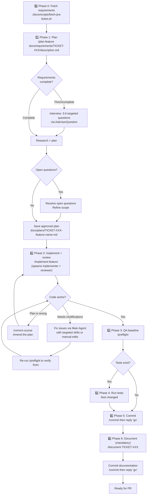

# Feature Development Workflow

> From Jira ticket to merged PR — how to use the AI tooling effectively for both simple and complex features.

For canonical agent and skill definitions, use [`../03-reference/ai-tools-reference.md`](../03-reference/ai-tools-reference.md).

---

## Quick decision guide

| Feature scope                                  | Recommended path                            |
| ---------------------------------------------- | ------------------------------------------- |
| Single-file change or minor UI tweak           | [Direct → QA → Commit](#simple-features)    |
| New React component inside an existing widget  | `/react-new-widget` or `/react-form-wizard` |
| New GraphQL operation (any scope)              | `/gql` (auto-detects PHP vs React-only)     |
| Magento plugin or interceptor                  | `/plugin`                                   |
| Magento event observer                         | `/observer`                                 |
| Theme template/layout override                 | `/create-theme-override`                    |
| DOM bridge hook for Magento JS ↔ React         | `/react-dom-hook`                           |
| Admin-configurable settings (system.xml)       | `/admin-config`                             |
| New DB column, table, or EAV attribute         | `/data-patch`                               |
| Transactional emails (confirmation + internal) | `/email-template`                           |
| New feature spanning multiple layers           | [Full workflow](#complex-features)          |
| Plan is wrong mid-implementation               | `/correct-course` to amend the plan         |

---

## Complex feature implementation



Use this path for features spanning multiple layers (for example: PHP module work, GraphQL schema/resolvers, React widgets, and email flows). It is a skill-first workflow, with each phase mapped to a dedicated skill that orchestrates agents under the hood.

**Model allocation principle — "Opus reasons, Sonnet reads":** You invoke skills (e.g. `/preflight`, `/commit`, `/test`), which internally spawn agents on the appropriate model. Research agents (`codebase-qa`, `impact-analyser`) and mechanical agents (`preflight`, `committer`, `test-runner`) run on Sonnet for speed and cost efficiency. Reasoning-heavy agents (`feature-planner`, `feature-implementer`, `reviewer`, `documenter`) run on Opus for higher-quality output.

### Phase 0 — Fetch requirements

```bash
./docs/scripts/fetch-jira-ticket.sh <TICKET-ID>
```

Fetches the full Jira ticket (description, comments, and all attachments including mockup images) into `docs/requirements/<TICKET-ID>/`. This step ensures the planner has access to UI mockups for correct layout placement — not just the text description.

Credentials are read from `.env.development` (`JIRA_EMAIL` and `JIRA_API_TOKEN`). See `.env.development.example` for the format. You can also pass credentials explicitly: `./docs/scripts/fetch-jira-ticket.sh <email> <token> <TICKET-ID>`.

### Phase 1 — Plan

```
/plan-feature docs/requirements/<TICKET-ID>/description.md
```

The `/plan-feature` skill orchestrates the full planning workflow: it first assesses whether the requirements are detailed enough — if acceptance criteria, layers, data model, or UI patterns are missing, it conducts a short interview (3-6 targeted questions via `AskUserQuestion`) to clarify scope before spending tokens on research. Answers are saved to `docs/requirements/<TICKET-ID>/interview-supplement.md` and fed into both the research and planning phases. If requirements are already detailed, the interview is skipped entirely. It then spawns `codebase-qa` sub-agents to research how reference features implement the needed patterns, spawns `impact-analyser` sub-agents to assess ripple effects on shared files, then passes all findings to the `@feature-planner` agent. The planner synthesizes the research into a file-by-file implementation plan ordered by layer — and can read mockup images in `docs/requirements/<TICKET-ID>/attachments/` for UI placement context. Save its output to `docs/plans/TICKET-XXX-feature-name.md`.

> **Before implementing — comprehension checkpoint:** Don't just resolve open questions. Verify you can explain the feature's data flow end-to-end from the plan: how user input enters, crosses layers, gets processed, and returns. If you can't, use `@codebase-qa` to fill gaps before proceeding. Approving a plan you don't understand leads to comprehension debt (see `05-concepts/knowledgebase-comprehension-debt.md`).

### Phase 2 — Implement and review

```
/implement-feature docs/plans/TICKET-XXX-feature-name.md
```

The `/implement-feature` skill orchestrates the full implementation workflow in four phases:

1. **Validates the plan** — checks for unresolved open questions (`TODO`, `TBD`, `?` markers)
2. **Spawns `@feature-implementer`** in the working directory — writes all files, runs type-check/lint/build, produces a change summary
3. **Spawns `@reviewer`** to review the uncommitted changes
4. **Reports combined results** — change summary, verification results, checklist progress, code review findings, and key files to understand

The review feedback is **informational output for the user** — it does not trigger automated fixes. You decide which findings to address and how.

> The output includes a **"Key files to understand"** list — read those files and trace the primary data flow yourself before moving on. The review checks correctness, but only you can verify that you understand what was built. See `05-concepts/knowledgebase-comprehension-debt.md`.

#### When the plan is wrong — course correction

If during implementation or review you discover the plan won't work (an assumption was wrong, a dependency doesn't behave as expected, or requirements changed), amend the plan before continuing:

```
/correct-course docs/plans/TICKET-XXX-feature-name.md "reason for the deviation"
```

This compares the plan to the current implementation state (checklist progress, files changed, git log signals), proposes targeted amendments, and updates the plan file after your approval. A Course Corrections log is appended to the plan documenting what changed and why — this feeds the documenter's lessons learned step later. Resume implementation from the updated plan.

#### When a bug needs runtime debugging

If the generated code doesn't work and the issue isn't obvious from the review feedback or static checks, use `/debug-frontend` to diagnose it with runtime evidence rather than guessing. There are two approaches depending on complexity:

**Inline debugging (single bug, straightforward to reproduce):** Run `/debug-frontend` directly in your current session. The skill walks you through hypothesis generation, code instrumentation, reproduction (automated via Playwright when available, or manual), and log-based analysis — all within the same conversation. This is the simplest path: one session, no context switching. The debugging output adds to your conversation history, but Claude Code compresses older messages automatically, and the subsequent phases (`/preflight`, `/test`, `/commit`) spawn their own agents that read from the filesystem, not from conversation history.

**Branched debugging (multiple bugs, or a complex issue requiring extended investigation):** If you're dealing with several bugs or an issue that will require many iterations of hypothesise-instrument-reproduce-analyse, consider branching off the main Claude Code session using the `/branch` command for the debugging work. The branched session starts with the context of the old session and can read the same codebase. Once in the new branched session, run `/debug-frontend`. Once the fix is implemented, go back to the previous session using the `/resume` command. The fix lands in the filesystem (your git working tree), so when you return to your main session the code changes are already visible. This keeps your main session's context focused on the feature implementation flow, which is valuable when the remaining phases (QA, commit, documentation) benefit from that accumulated context. Use this approach when you expect the debugging to be a long, verbose conversation that would push useful implementation context out of the window.

### Phase 3 — QA

```
/preflight
```

Runs the full preflight quality suite. The specific checks depend on your stack — see CLAUDE.md Commands section for what runs. Typically includes linting, type-checking, production build, accessibility audits for frontend, runtime smoke test via Playwright (navigates pages, checks for JS errors and hydration failures), and code style and static analysis for backend.

Fix any reported issues before committing.

If you only need one layer while iterating, pass the layer name:

```
/preflight react    # Frontend-only checks
/preflight php      # Backend-only checks
```

**Optional — visual regression and performance:** If the feature includes CSS, layout, or component changes, consider running these before committing:

```
/visual-regression http://localhost:3000/affected-page    # Screenshot comparison
/lighthouse-audit http://localhost:3000/affected-page     # Performance/a11y scores
```

### Phase 4 — Run tests (if applicable)

```
/test changed
```

Run after preflight and before committing. The `/test` skill runs tests for changed files only. If no test infrastructure exists yet, this phase can be skipped — but consider running `/react-add-tests setup` to bootstrap Vitest for future work.

### Phase 5 — Commit

```
/commit
```

The `/commit` skill analyses all uncommitted changes, reads the modified files to understand their layer, and proposes a logical breakdown into ordered commits following the message format from CLAUDE.md → Commit Conventions (typically `TICKET-XXX: Verb phrase`). Review the proposed plan, then reply `"go"` to execute.

### Phase 6 — Document (mandatory)

```
/document TICKET-XXX
```

**This phase is not optional.** Every complex feature must have an architecture document before the PR is created. Without it, future developers (and AI agents) have no way to understand the feature's design without re-reading every file.

The `/document` skill reads the code on the current branch and generates `docs/features/TICKET-XXX-feature-name.md`. The document includes Mermaid diagrams, module structure, data flows, admin configuration, deployment steps, and feature screenshots captured via Playwright (when the dev server is available). Review the generated document, resolve any `[TODO: verify]` items, and commit it as a final commit on the branch.

---

## Skills for specific feature types

### New React widget

```
/react-new-widget my-feature
```

Creates `widgets/my-feature-widget.tsx` and a component directory. Prompts you to confirm the Magento integration (PHTML + layout XML) before creating those files.

### Multi-step form wizard

```
/react-form-wizard HireForm
```

Scaffolds the full FormWizard structure following the project's existing multi-step form patterns (see CLAUDE.md Reuse table): main form component, individual step components with Zod validation, and GQL types. Asks for step count and field definitions.

### GraphQL operation

```
/gql productAvailability
```

Auto-detects whether the PHP schema already defines the operation. If it does, creates just the React data layer (GQL file, provider method, TypeScript types). If not, also scaffolds the `schema.graphqls` additions and resolver — showing the proposed schema changes before writing.

### Magento plugin

```
/plugin Magento\Catalog\Model\Product::getPrice
```

Reads the vendor class, determines the correct plugin type (`before`/`after`/`around`), creates the plugin class in the right module, and registers it in `di.xml`.

### Theme template/layout override

```
/create-theme-override Magento_Catalog/catalog/product/view.phtml
```

Finds the original in vendor, copies it to the theme directory, shows the original content, and waits for your instructions before modifying it.

### DOM bridge hook

```
/react-dom-hook ConfigurablePrice
```

Creates a `useConfigurablePrice.ts` hook using MutationObserver to bridge Magento's vanilla JS DOM mutations into React state, following the `useConfigurableOptions` pattern.

---

## Documenting what you built

After implementing a significant feature, create a feature document:

```
docs/features/TICKET-XXX-feature-name.md
```

Include:

- Architecture overview (Mermaid diagram recommended)
- Data flow for key operations (form submission, GraphQL queries, email)
- Admin configuration paths
- Deployment steps

See existing files in `docs/features/` for examples.

---

## Branch and commit conventions

| Item               | Convention                                                                |
| ------------------ | ------------------------------------------------------------------------- |
| Branch name        | `feature/TICKET-XXX-short-description` or `bugfix/TICKET-XXX-description` |
| Commit message     | `TICKET-XXX: Verb phrase describing the change`                           |
| Commit granularity | One logical unit per commit — the `/commit` skill handles this            |
| Base branch        | See CLAUDE.md → Commit Conventions for the main branch name               |

The `/commit` skill extracts the ticket number from the branch name automatically.
