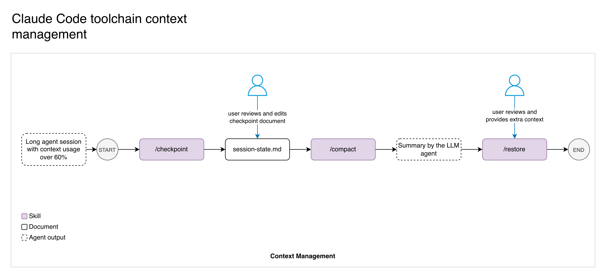

# Context Management

> How to keep long sessions productive by checkpointing state before compacting context.

For canonical command syntax and inventory, use [`../03-reference/ai-tools-reference.md`](../03-reference/ai-tools-reference.md).

---

## Why context matters

Claude Code's context window holds your entire conversation: every message, file read, and command output. As it fills, performance degrades — Claude may forget earlier instructions or make mistakes. The `/compact` command compresses conversation history to free space, but it loses transient details like verification results, plan file paths, and which workflow phase you were in.

The `/checkpoint` skill solves this by saving critical session state to disk **before** you compact.

---

## The checkpoint-compact-restore cycle



```
/checkpoint          Save state to disk
/compact             Compress conversation history
/restore             Reload context from the checkpoint file
```

Three commands, in that order. You can review and edit the checkpoint file between steps, and add extra context after compaction when restoring.

---

## When to checkpoint

| Situation | Action |
|-----------|--------|
| Context feels heavy (slow responses, repeated mistakes) | `/checkpoint` then `/compact` |
| Switching from planning to implementation | `/checkpoint` then `/compact` to start implementation with a clean context |
| After a long implementation session, before review | `/checkpoint` then `/compact` |
| Before stepping away from a session you'll resume later | `/checkpoint` (compact is optional) |
| After running `/preflight` with many results | `/checkpoint` to save the verification results |

You do **not** need to checkpoint before every compact. Use it when there is transient state worth preserving — verification results, review findings, decisions made during the session. If you're between tasks with nothing in-flight, `/compact` alone is fine.

---

## What gets saved

`/checkpoint` writes to `docs/requirements/<TICKET>/session-state.md` and captures:

- **Identity** — ticket number, branch name
- **Workflow phase** — inferred from what exists on disk (plan file, code changes, commits)
- **Plan status** — file path, checklist progress (X of Y items done), open questions
- **Modified files** — uncommitted and staged changes, recent commits
- **Verification results** — type-check, lint, build, smoke test pass/fail (if available in the session)
- **Review findings** — key issues from code review (if a review was run)
- **Key context** — decisions, user preferences, and approach choices from the conversation

---

## Recovering after compaction

After running `/compact`, run:

```
/restore
```

The `/restore` skill reads the checkpoint file, the plan file, and current git state, then presents a summary of where you left off with a suggested next step. It infers the ticket from the branch name automatically — or you can pass it explicitly: `/restore ABC-123`.

If you forget to `/restore` and just start working, the orchestrator skills (`/plan-feature`, `/implement-feature`, `/correct-course`) also check for `session-state.md` at startup and report saved state if found.

---

## Automatic milestone saves

The orchestrator skills (`/plan-feature`, `/implement-feature`, `/correct-course`) also write to `session-state.md` automatically at key milestones:

- **`/plan-feature`** — saves after the planner agent completes (agent activity summary, interview status, open questions)
- **`/implement-feature`** — saves after implementation (verification results, change summary, checklist progress) and again after review (adds review findings)
- **`/correct-course`** — saves before asking you to approve amendment proposals

These automatic saves mean that even if you forget to `/checkpoint` before compacting mid-workflow, some state will already be on disk. The `/checkpoint` skill produces a more comprehensive snapshot since it also captures conversation-specific context like decisions and preferences.

---

## Tips

- **`/checkpoint` is cheap.** It reads a few files and runs git commands. There's no reason not to run it.
- **The file is overwritten each time.** Each `/checkpoint` or milestone save replaces the previous one. There's no history — just the latest state.
- **Use `/clear` for task switches.** If you're switching to an unrelated task, `/clear` is better than `/compact` — it fully resets context instead of compressing it. No checkpoint needed since you're starting fresh.
- **Resuming a previous session.** If you return to a session with `claude --continue`, run `/restore` to reload context from the last checkpoint. This refreshes your context from disk even without compacting.
